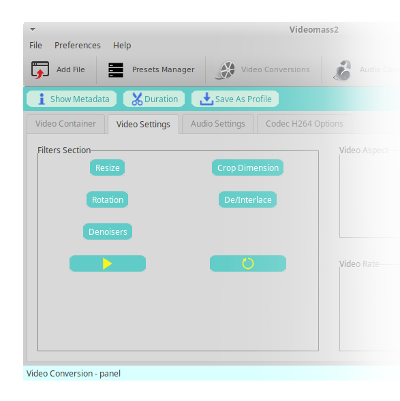
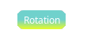

[Back](../../videomass2_use.md)

## Video filters section

The video **Filters Section** is located in the _Video Conversion_ panel on the _Video Settings_ tab. 
All available filters are auto-chained and can be played simultaneously with the preview button 
(the one with the yellow play icon). When a certain filter is set, the corresponding button will assume 
a yellow gradient:    

[Back](../../videomass2_use.md)
