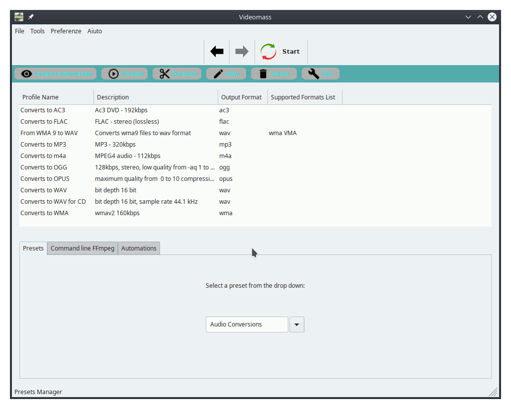

[Back](../../../videomass_use.md)

## Presets Manager

Presets Manager is an interface that allows a quick selection of profiles to start a conversion process. It is based on two types of lists: the list of presets, selectable by a drop down, and the list of selectable profiles.   
Each preset contains one or more profiles wich can also be edited or deleted. You can also create new presets and new profiles.

### Create a new preset
To create a new preset, go on *menu bar > File > Create new preset*.   
You can create new presets only on the Presets Manager which will be stored on the presets folder in the Videomass configuration directory. The preset drop-down menu will be automatically updated with a new entry. Each preset is a simple text file with a JSON data structure and a ".prst" extension.   

### Create a new profile
To create a new profile froma scratch, type the button *New...* and a window will appear allowing you to catalog any type of profile which will be saved on the current selected preset. You can store new profiles on any selecting preset. 

- "_Profile Name_" a short description .

- "_Description_" more longer description.

- "1-PASS" allows you to enter the first pass command.

- "2-PASS" allows you to enter the second pass command. This is optional.

- "_Files supported_" field is optional and useful to include a certain input formats type. When you specify more than one format must be separated by comma.
  
- "_Output format_", extension of the output filename. If you want to copy the original format and codec, you can leave empty.

### _Presets_ tab
In this tab there is a list of all presets that can be selected from a drop-down menu. 

### _Command Line FFmpeg_ tab
By selecting the 'Command Line FFmpeg' tab you will see the command of each selected profile. Here you can change the command on the fly by adding new parameters and the conversion process will execute exactly the command you wrote. Remember that a profile changed on the fly will not be stored on the profile. To save a new profile, you will need to use the 'New..' or 'Edit..' functions in the toolbar.

### _Automations_ tab
Since each audio file sounds different, there is no way to use the same analyzed data for all audio files, so from Videomass v2.0.0 the presets manager has audio normalization and audio streams mapping controls to make normalization processes easily usable. 

### Start conversion
Start the conversion by double clicking on a profile or selecting the profile and clicking the *Start* button on the top toolbar.

[Back](../../../videomass_use.md)
