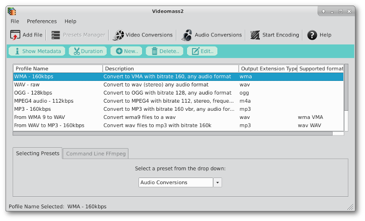

[Back](../../../videomass2_use.md)

## Presets Manager

Presets Manager is an interface that allows a quick selection of profiles to start a conversion process. It is based 
on two types of lists: the list of presets, selectable by a drop down, and the list of selectable profiles.   
Each preset contains one or more profiles that can also be edited or deleted. A user can also create new profiles and 
organize them on certain presets.   

A single click on a profile allows you to use it for a conversion process, or to modify or remove it.  
Double-clicking on a profile opens a profile editing window (the same can be done by pressing the _Edit_ button).

**Note**: each preset is an xml file with a _.vdms_ extension containing the entries of each profile stored on a 
specific preset. All presets are located in the Videomass2 configuration folder.

### Menubar
With **Presets Manager** interface, the following functions are enabled in the menubar - _File_:

- _Save the current preset as separated file_ (export the selected preset)

- _Restore a previously saved preset_ (import and replace a preset)

- _reset the current preset_  (ie return to the default state)   

- _reset all presets_ (reset all presets at once. This will erase all your customizations 
  to return to the original state.)

- _Reload Presets List_ (This feature can be useful when you import new presets previously exported to recharg the new one)

### Tools buttons
   
These buttons are shown on the toolbar when the **Presets Manager** interface is active.
* To create a [new profile](https://jeanslack.github.io/Videomass2/Pages/Main_Toolbar/PresetsManager_Panel/Profiles_management.html), press the _New.._ button in the toolbar.
* To delete a profile, press the _Delete.._ button in the toolbar.
* To [edit a profile](https://jeanslack.github.io/Videomass2/Pages/Main_Toolbar/PresetsManager_Panel/Profiles_management.html). press the _Edit.._ button in the toolbar.

### The _Selecting Preset_ tab
In this tab there is a list of all presets that can be selected from a drop-down menu.   
**Note:** "_User Profiles_" is a particular menu item where the profiles that you saved from the Video 
Conversions and Audio Conversions interfaces are stored.

### The _Command Line FFmpeg_ tab
By selecting the 'Command Line FFmpeg' tab you will see the command of each selected profile. To change a command on the 
fly, you must first enable the write function on the [Setup dialog](https://github.com/jeanslack/Videomass2/blob/gh-pages/Pages/Startup/Setup.md). Remember that a profile changed on the fly will only be applied in the conversion process but will 
not be stored on the profile. To save a new profile, you will need to use the 'New..' function in the toolbar.

### Start Encoding
When you select a profile and press the _Start Encoding_ button in the main toolbar, the process immediately starts with the parameters of the selected profile. 

At the end of the process the preview button is displayed in the toolbar, which you can use to check the conversion result.

[Back](../../../videomass2_use.md)
