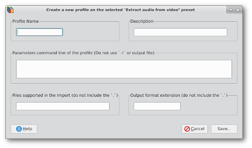

[Back](../../../videomass2_use.md)

## Profiles Management
The window for managing profiles is used to create new profiles, to add new settings and to edit existing profiles. 
It is composed of five text fields, four of which are mandatory.
- "_Profile Name_" is a short description that you specify as an identification.

- "_Description_" is a longer description.

- "_Command Line Parameters_" allows you to enter the FFmpeg command. The rule is not to enter the input and output 
  parameters, ie the command call of FFmpeg and any '-i' flags and the names of the imported and exported files but 
  only the command settings. For conversions that involve a double pass, use the string **DOUBLE_PASS** as a separator 
  between the first and second pass, for example:
  ```
  -an -vcodec libx264 -b:v 1500k -f rawvideo DOUBLE_PASS -vcodec libx264 -b:v 1500k
  ```
- "_Files supported in the import_" field is optional and is useful for limiting the importation of one or more formats 
  that you can specify or not. When you specify a list of formats, they must be separated by a white space.
  
- "_Output format extension_", Here you have to specify the name of the output format (extension), without including 
  the dot '.' and any other punctuation mark.

### How to create a New profile
To create a new profile it is necessary to move to the _Presets Manager_ interface by pressing the relative button in the main toolbar and then pressing the "_New_" button on the secondary toolbar.  
You will then see this window appear:   
 

### How to modify an existing profile
You can edit each selected profile and save it with your new settings by pressing the '_Edit_' button from the 
secondary toolbar, when you are on the _Presets Manager_ interface. The rules are the same as when you create a 
new profile.

### How to delete a profile
Go to the _Presets Manager_ interface by pressing the corresponding button on the main toolbar, select a profile to delete and then press the "Delete" button on the secondary toolbar. This will permanently delete the selected profile.

### Save new profiles from Video Conversions and Audio Conversions interfaces
New profiles can also be added from the _Video Conversions_ and _Audio Conversions_ interfaces. Whenever you set a specific parameter configuration and press the 'Save as Profile' button, you will save those parameters in the 'User Profile' preset of the 'Presets Manager' interface.
 

[Back](../../../videomass2_use.md)
