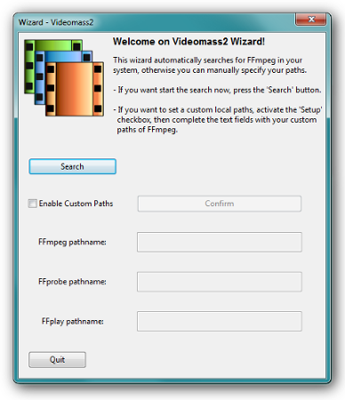

[Back](../../videomass_use.md)

## Windows and MacOs Users

Windows and MacO users will be assisted by a wizard to determine the existence and location of FFmpeg.   
    
Usually FFmpeg is included in the Videomass.exe/Videomass.dmg and it will not be a big matter if FFmpeg is not 
installed on your system.

## All

During the first start-up, the application provides a drag n drop interface in which it is possible to load several files 
at a time. Once you have dragged at least one file, the **Presets Manager**, **Video Conversions** and **Audio Conversions** buttons on the main toolbar are enabled. You can choose a specific export path or export to the same source path. 
The **clear** button will delete the entire contents of the loaded list. A contextual menu is available that can be activated 
with a double click or with the right mouse button to playback, view metadata or delete the selected files.

[Back](../../videomass_use.md)
