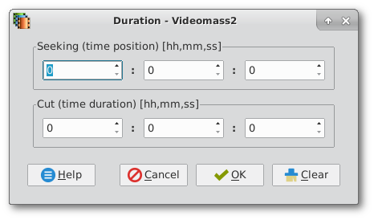
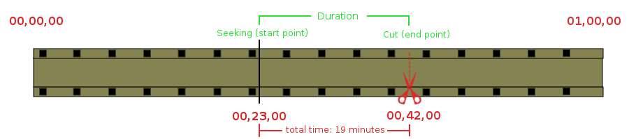

[Back](../../videomass_use.md)

## Duration

The Duration tool consists of two different parameters: 
**Seeking** (time position) and **Cut** (duration) both expressed in hours, minutes and seconds (hh,mm,ss).
Note that on Videomass the Cut parameter (duration) always refers to the total duration from the set Seeking 
point (if set), and not from the beginning of the first scene of a movie.

 

When set with time values above zero and then confirmed with the Ok button, the Duration button in the secondary 
toolbar is turned with a green gradient.   
   
When all time values are reset with the Clear button and then confirmed with the Ok button, the Duration button will 
revert to default color.   

----------------

### _How can I extract a segment from a media?_
If you need to extract only a specific part of your media file, you will need to use the Seeking parameter and the Cut 
parameter to get a specific section of the time position.   
To extract only a small segment in the middle of a movie, it must be used in conjunction with Cut, which specifies the 
duration; it is not possible to use the Seeking parameter alone as it needs to be used with the Cut parameter.   

Example: if we have a film with a duration of one hour, to extract a segment from the twenty-third to forty-second 
minutes from the beginning of the film, we have to set the Seeking parameter to 00.23.00 and the Cut parameter to 
00.19, 00.  See the graph below.   

----------------

### _Tip_
To find out the overall duration of an imported media file, you can use the [Show Metadata](Show_metadata.md) tool.

----------------

### _Trick_ 
To perform conversion tests, you can use the **Cut** parameter to set a short duration without waiting for the end 
of a whole process (which can sometimes be very long).

----------------

### _IMPORTANT NOTES:_ 
When set, the Duration tool generates a parameter that is extended globally, ie in all used conversion processes
with the _Presets Manager_, _Video Conversions_, _Audio Conversions_, _playback_, _audio normalization_, _images extraction_, etc. 
Keeping this principle in mind, it is possible to enable or disable this instrument as needed.

----------------

[Back](../../videomass_use.md)
