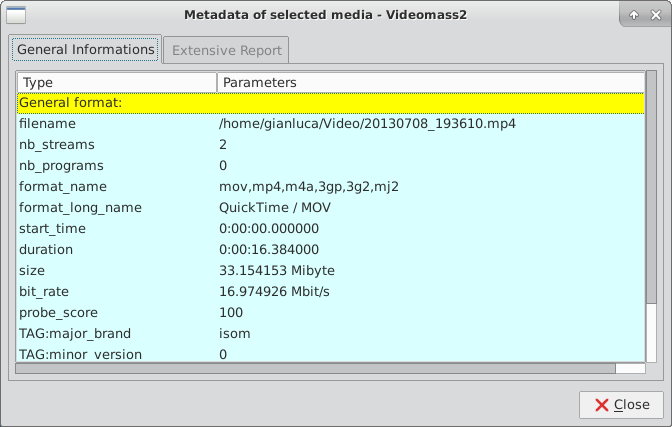
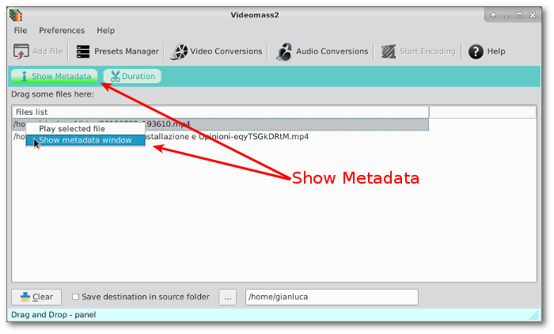

[Back](../../videomass2_use.md)

## Show Metadata

Show Metadata is a tool for viewing all the information contained in each imported and selected media file in 
an orderly manner. You can also run multiple open instances on different media files, for example to make various 
data comparisons.   

It has two tabs, one for summary information and the other for more extensive information that may vary depending on the 
types of data contained in the files. 
Generally the following lists are marked in yellow:
- General format
- Video stream media (all index from 0 to max number)
- Audio media stream (all index from 0 to max number)
- Subtitle media stream (all index from 0 to max number)

    

It can be opened from the context menu by right click or double-click on the item imported in the _Drag n Drop_ interface. It can also be opened with the Show Metadata button located on the secondary toolbar. 

   

[Back](../../videomass2_use.md)
